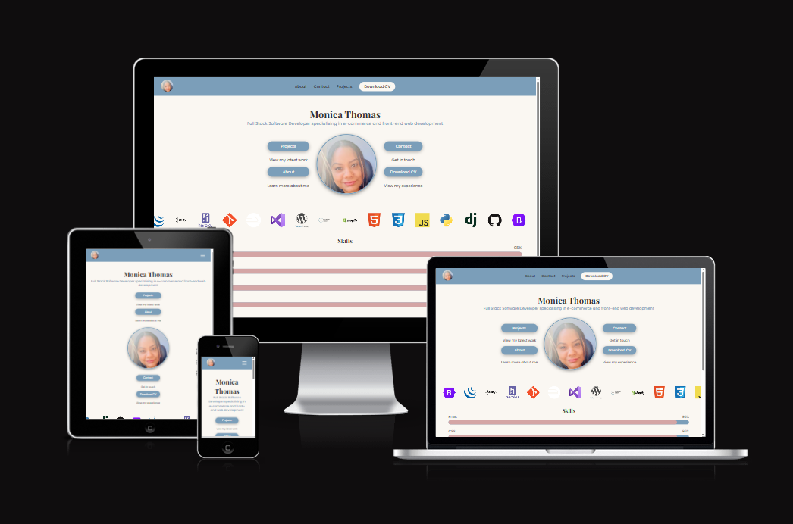
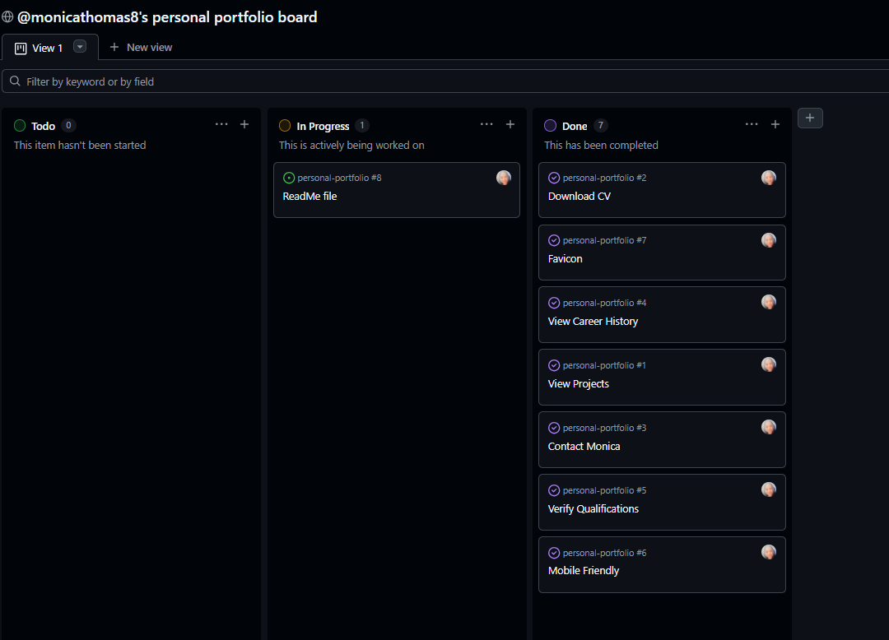

 # [Monica Thomas | Personal Portfolio](https://monicathomas8.github.io/personal-portfolio/)

## Overview

Welcome to my portfolio! I'm Monica, a passionate web developer specialising in 
e-commerce and building beautiful, functional websites. 

This site is a showcase of my skills, projects and experience. From career history
to live projects and everything in between.

The website can be accessed here: [Live Site](https://monicathomas8.github.io/personal-portfolio/)

## User Stories

The user stories for this project were managed using a GitHub Project Board.

[View Project Board](https://github.com/users/monicathomas8/projects/7)

* As an employer, I want to download Monica's CV so that I can review her experience offline.
    * Download CV button visible in navbar
    * Download CV button visible in footer
    * CV downloads as a PDF

* As a potential client or employer, I want to contact Monica easily so that I can discuss my project or arrange an interview.
    * Contact form with name, email and message fields
    * Contact details clearly displayed
    * Social media links visible

* As an employer, I want to see Monica's career history so that I can understand her background.
    * Career timeline displayed clearly
    * Each role has dates, title and description
    * No unexplained gaps

* As an employer, I want to verify Monica's qualifications so that I can confirm her credentials.
    * Diploma certificate displayed
    * Hackathon badges displayed
    * All credentials link to verified sources

* As a visitor, I want to navigate on mobile so that I can view the portfolio on any device.
    * Site is fully responsive
    * Navigation works on mobile
    * All content readable on small screens

* As a visitor, I want to see a recognisable icon in the browser tab so that I can easily find the tab when I have multiple tabs open.
    * A favicon appears in the browser tab
    * The favicon matches the portfolio's branding
    * It displays correctly across all pages

* As a visitor, I want to view Monica's projects so that I can assess her skill level and experience.
    * Projects displayed in a grid layout
    * Each project has a title, description and technologies used
    * Links to live site and GitHub repo provided

https://developer.mozilla.org/en-US/docs/Web/CSS/Reference/Properties/--*

https://developer.mozilla.org/en-US/docs/Web/CSS/Reference/Properties/animation

https://devicon.dev/

https://formspree.io/
