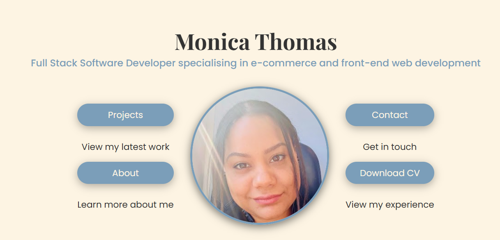
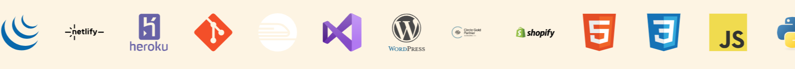
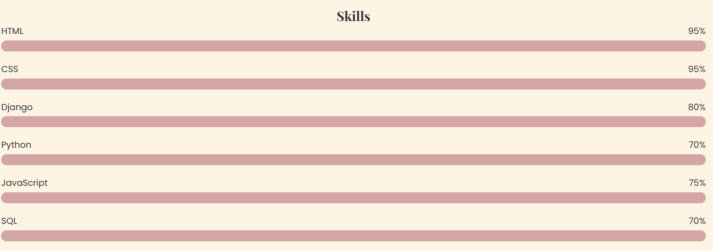
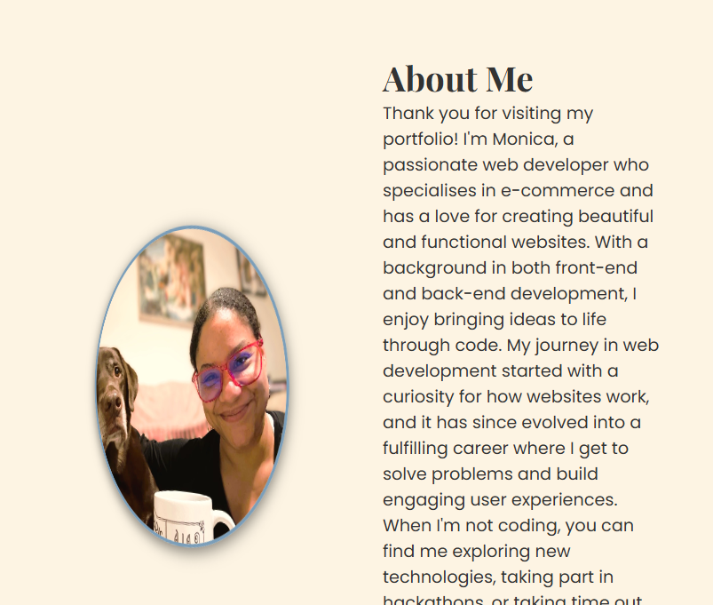
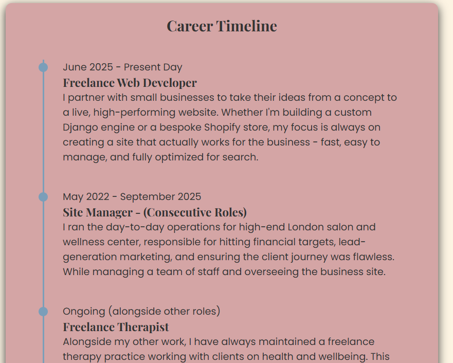
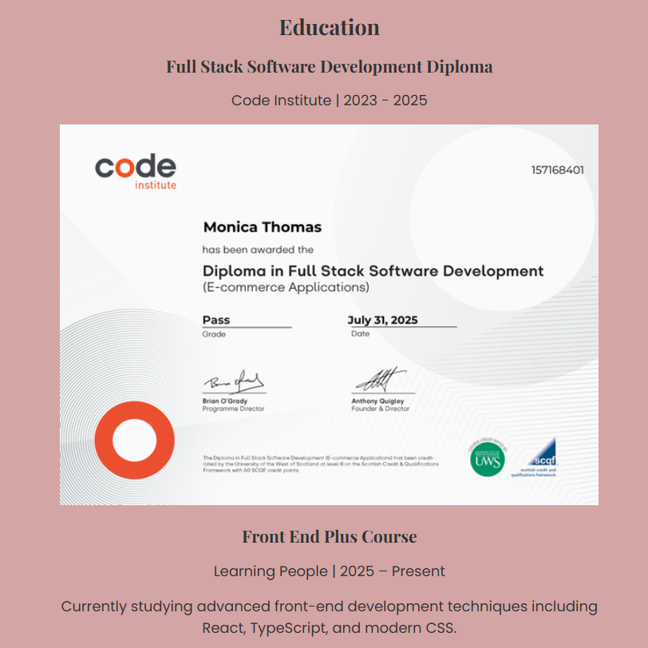
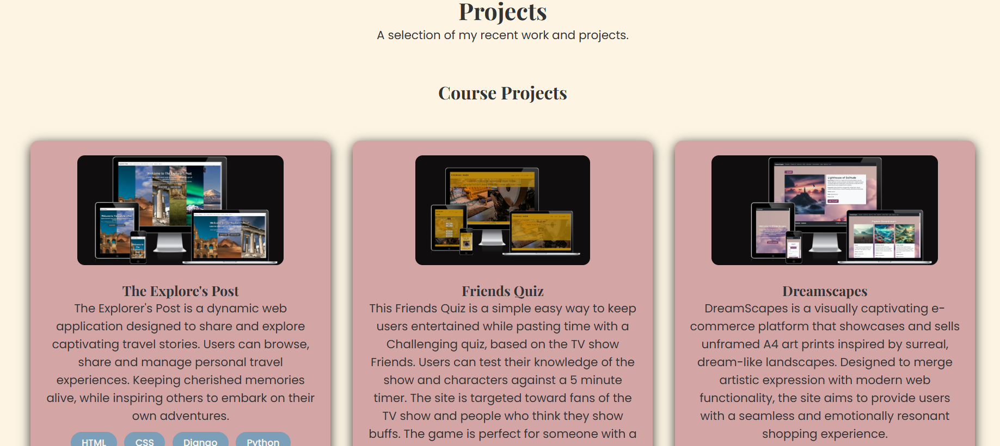
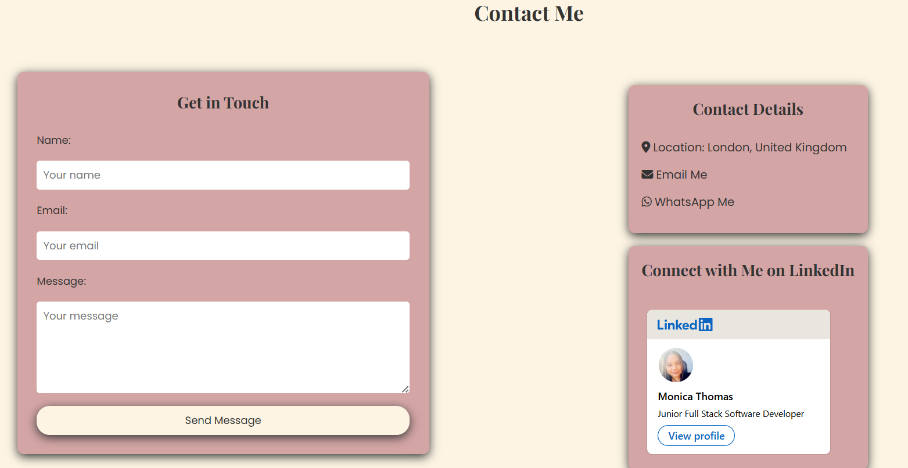
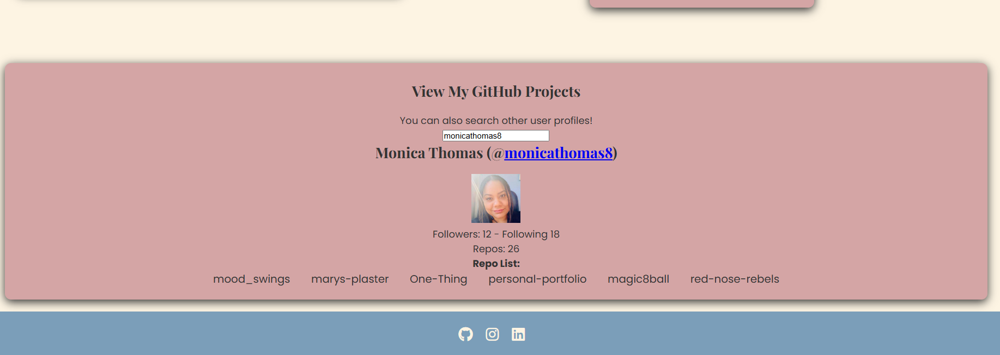

 # [Monica Thomas | Personal Portfolio](https://monicathomas8.github.io/personal-portfolio/)

## Overview

Welcome to my portfolio! I'm Monica, a passionate web developer specialising in 
e-commerce and building beautiful, functional websites. 

This site is a showcase of my skills, projects and experience. From career history
to live projects and everything in between.

The website can be accessed here: [Live Site](https://monicathomas8.github.io/personal-portfolio/)

## User Stories

The user stories for this project were managed using a GitHub Project Board.

[View Project Board](https://github.com/users/monicathomas8/projects/7)

* As an employer, I want to download Monica's CV so that I can review her experience offline.
    * Download CV button visible in navbar
    * Download CV button visible in footer
    * CV downloads as a PDF

* As a potential client or employer, I want to contact Monica easily so that I can discuss my project or arrange an interview.
    * Contact form with name, email and message fields
    * Contact details clearly displayed
    * Social media links visible

* As an employer, I want to see Monica's career history so that I can understand her background.
    * Career timeline displayed clearly
    * Each role has dates, title and description
    * No unexplained gaps

* As an employer, I want to verify Monica's qualifications so that I can confirm her credentials.
    * Diploma certificate displayed
    * Hackathon badges displayed
    * All credentials link to verified sources

* As a visitor, I want to navigate on mobile so that I can view the portfolio on any device.
    * Site is fully responsive
    * Navigation works on mobile
    * All content readable on small screens

* As a visitor, I want to see a recognisable icon in the browser tab so that I can easily find the tab when I have multiple tabs open.
    * A favicon appears in the browser tab
    * The favicon matches the portfolio's branding
    * It displays correctly across all pages

* As a visitor, I want to view Monica's projects so that I can assess her skill level and experience.
    * Projects displayed in a grid layout
    * Each project has a title, description and technologies used
    * Links to live site and GitHub repo provided

## Features

### Navigation
* A clean, responsive navigation bar is displayed at the top of every page.
* Includes links to About, Contact, Projects and a CV download button.
* On mobile, the navigation collapses into a burger menu for easy use on small screens.
* The image is a link to the home page and matches the favicon for the site.

### Hero Section
* The landing page features a welcoming hero section with a profile image.
* A short introduction and tagline clearly communicates who Monica is and what she does.
* Two sets of buttons provide quick navigation to key sections of the site.

### Tech Stack
* A scrolling banner displays the technologies Monica works with.
* The animation runs continuously, giving a dynamic feel to the page.
* Icons are sourced from Devicon for consistency in style.

### Skill Bars
* A visual representation of Monica's technical skill levels.
* Each skill bar animates on hover and on view, filling to the relevant percentage.
* Gives employers and clients a quick overview of Monica's strengths.

### About & Flip Card
* A brief biography introduces Monica and her background.
* A fun interactive flip card reveals a personal photo on hover, adding personality to the page.
* The flip card automatically rotates on a timer, revealing a personal photo without needing any interaction.

### Career Timeline
* A visual timeline displays Monica's career history in chronological order.
* Each entry includes dates, job title and a description of the role.
* Gives employers a clear overview of Monica's professional background.

### Education & Qualifications
* Displays Monica's educational background and qualifications.
* An embedded verified certificate links directly to the credential source.
* Allows employers to quickly verify Monica's qualifications with one click.

### Projects
* A responsive grid displays all of Monica's projects.
* Each project card shows a screenshot, title, description and technologies used.
* Each card links to a detailed project page with a live site and GitHub repository link.

### Contact Form
* A clean contact form allows visitors to get in touch directly from the site.
* Fields include name, email and message. All required before submission.
* Form submissions are handled by Formspree and delivered straight to Monica's inbox.

### GitHub Search
* An interactive GitHub search tool allows visitors to view Monica's GitHub projects.
* Visitors can also search any other GitHub username to view their repositories.
* Gives employers a quick way to explore Monica's code directly from the portfolio.
* This feature was adapted from a previous project. 

### Footer
* A consistent footer is displayed across all pages.
* Includes social media links to GitHub, Instagram and LinkedIn.
* A CV download button allows employers to download Monica's CV from any page.
* Copyright information is displayed at the bottom.

https://developer.mozilla.org/en-US/docs/Web/CSS/Reference/Properties/--*

https://developer.mozilla.org/en-US/docs/Web/CSS/Reference/Properties/animation

https://devicon.dev/

https://formspree.io/
