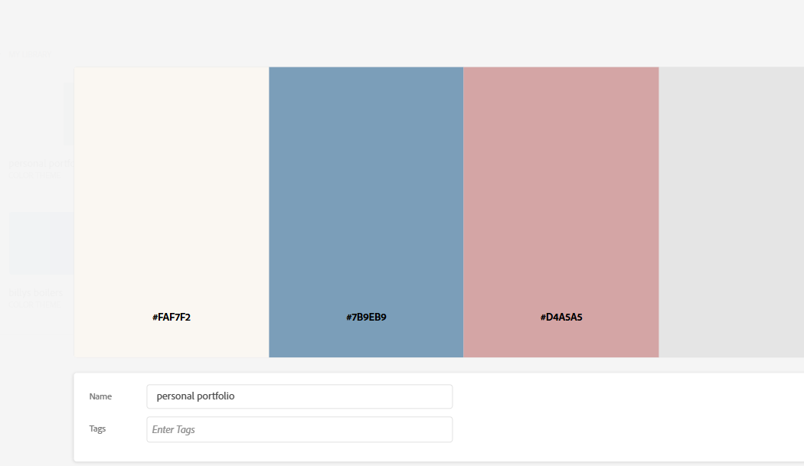
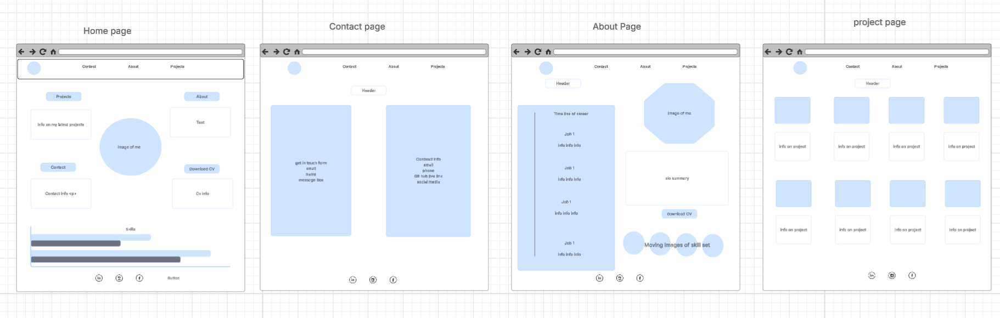
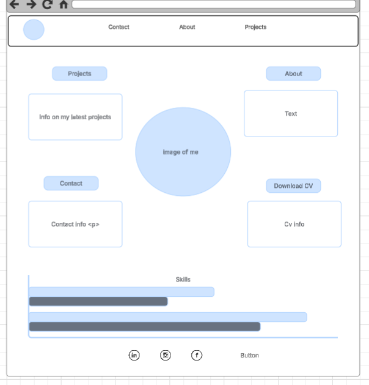
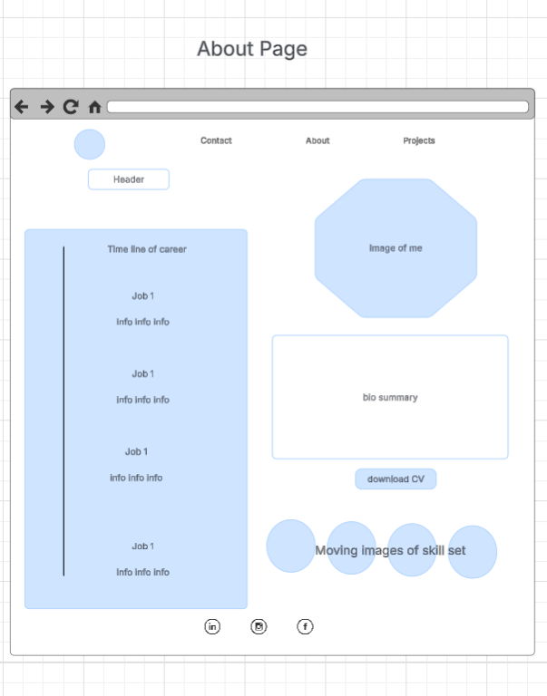
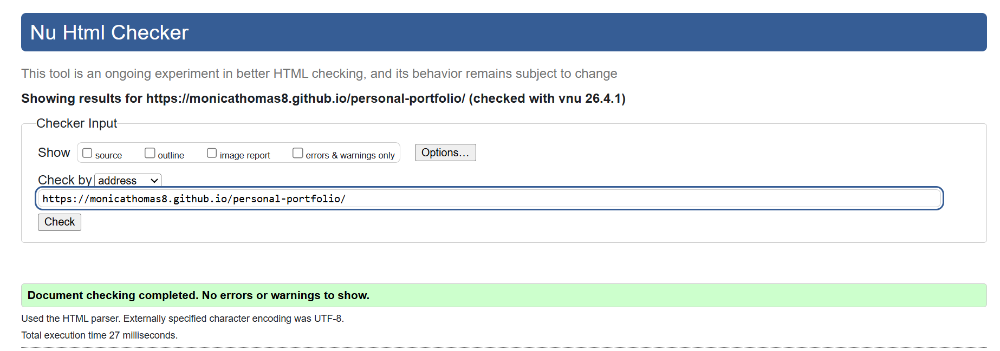
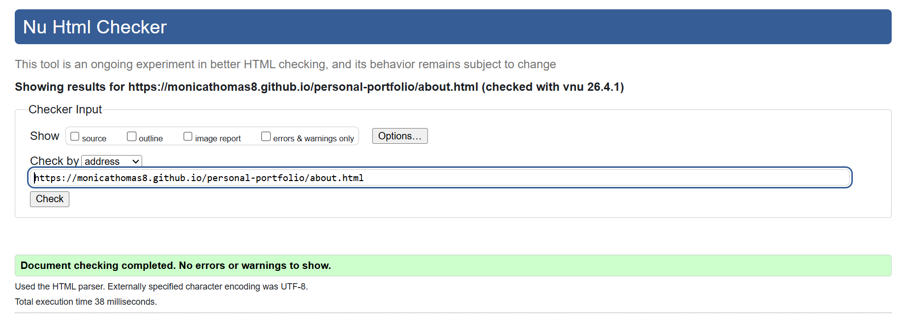
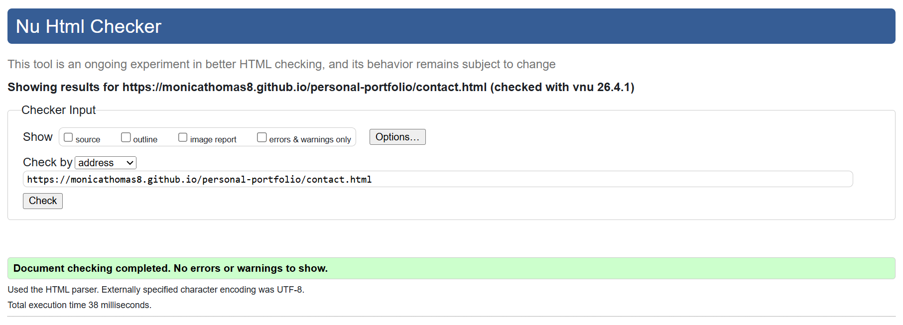
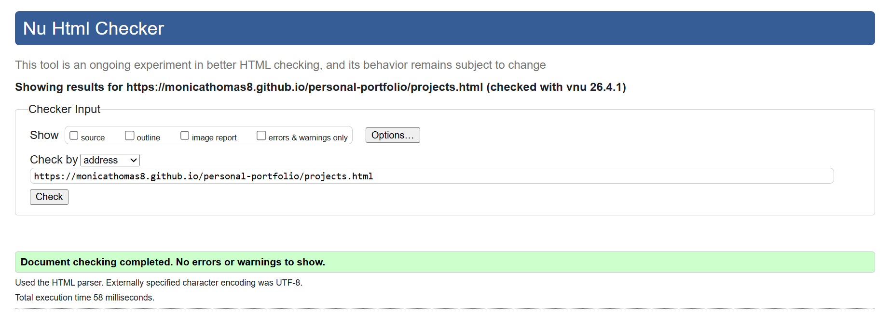
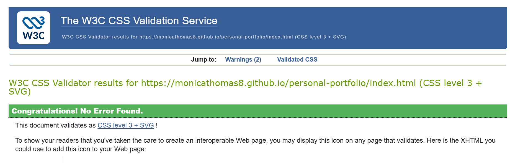
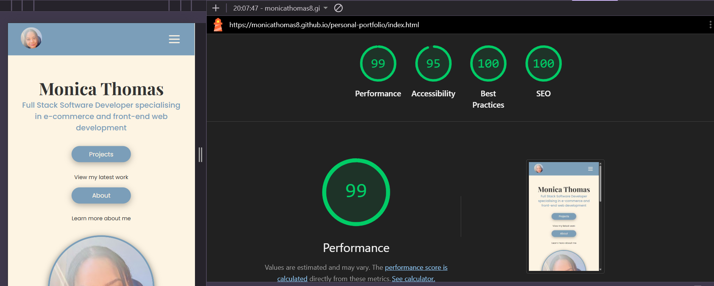

# Monica Thomas | Personal Portfolio
## Overview

Welcome to my portfolio! I'm Monica, a passionate web developer specialising in 
e-commerce and building beautiful, functional websites. 

This site is a showcase of my skills, projects and experience. From career history
to live projects and everything in between.

**The website can be accessed here: [Live Site](https://monicathomas8.github.io/personal-portfolio/)**


## Summary
This personal portfolio website was designed and built by Monica Thomas as part of the Learning People Front End Plus course. 

The site showcases Monica's skills, experience and projects as a Full Stack Web Developer specialising in e-commerce and front-end development.

The site is fully responsive, accessible and deployed live via GitHub Pages. 

It was built using only HTML and CSS with vanilla JavaScript, with a focus on clean code, good UX design and professional presentation.


## User Stories

The user stories for this project were managed using a GitHub Project Board.


[View Project Board](https://github.com/users/monicathomas8/projects/7)

* As an employer, I want to download Monica's CV so that I can review her experience offline.
    * Download CV button visible in navbar
    * Download CV button visible in footer
    * CV downloads as a PDF

* As a potential client or employer, I want to contact Monica easily so that I can discuss my project or arrange an interview.
    * Contact form with name, email and message fields
    * Contact details clearly displayed
    * Social media links visible

* As an employer, I want to see Monica's career history so that I can understand her background.
    * Career timeline displayed clearly
    * Each role has dates, title and description
    * No unexplained gaps

* As an employer, I want to verify Monica's qualifications so that I can confirm her credentials.
    * Diploma certificate displayed
    * Hackathon badges displayed
    * All credentials link to verified sources

* As a visitor, I want to navigate on mobile so that I can view the portfolio on any device.
    * Site is fully responsive
    * Navigation works on mobile
    * All content readable on small screens

* As a visitor, I want to see a recognisable icon in the browser tab so that I can easily find the tab when I have multiple tabs open.
    * A favicon appears in the browser tab
    * The favicon matches the portfolio's branding
    * It displays correctly across all pages

* As a visitor, I want to view Monica's projects so that I can assess her skill level and experience.
    * Projects displayed in a grid layout
    * Each project has a title, description and technologies used
    * Links to live site and GitHub repo provided

## Design

### Colour Palette
The following three colours were chosen for the site to keep a clean, professional feel:



* `#FDF4E3` - Warm cream background
* `#7B9EB9` - Muted blue for headers and accents
* `#D4A5A5` - Soft rose for cards and highlights
* **Note:** During development the background colour was updated from `#FAF7F2` to `#FDF4E3` for a warmer, more pigmented cream tone.

### Wireframes
Wireframes were created at the start of the project to plan the layout of each page.








## Features

### Navigation
* A clean, responsive navigation bar is displayed at the top of every page.
* Includes links to About, Contact, Projects and a CV download button.
* On mobile, the navigation collapses into a burger menu for easy use on small screens.
* The image is a link to the home page and matches the favicon for the site.


### Hero Section
* The landing page features a welcoming hero section with a profile image.
* A short introduction and tagline clearly communicates who Monica is and what she does.
* Two sets of buttons provide quick navigation to key sections of the site.


### Tech Stack
* A scrolling banner displays the technologies Monica works with.
* The animation runs continuously, giving a dynamic feel to the page.
* Icons are sourced from Devicon for consistency in style. 
* Squarespace and Shopify icons are sourced from Monica's personal Squarespace account and Shopify's public image library respectively.


### Skill Bars
* A visual representation of Monica's technical skill levels.
* Each skill bar animates on hover and on view, filling to the relevant percentage.
* Gives employers and clients a quick overview of Monica's strengths.


### About & Flip Card
* A brief biography introduces Monica and her background.
* A fun interactive flip card reveals a personal photo on hover, adding personality to the page.
* The flip card automatically rotates on a timer, revealing a personal photo without needing any interaction.


### Career Timeline
* A visual timeline displays Monica's career history in chronological order.
* Each entry includes dates, job title and a description of the role.
* Gives employers a clear overview of Monica's professional background.


### Education & Qualifications
* Displays Monica's educational background and qualifications.
* An embedded verified certificate links directly to the credential source.
* Allows employers to quickly verify Monica's qualifications with one click.


### Projects
* A responsive grid displays all of Monica's projects.
* Each project card shows a screenshot, title, description and technologies used.
* A few selected cards links to a detailed project page with a live site and GitHub repository link.


### Contact Form
* A clean contact form allows visitors to get in touch directly from the site.
* Fields include name, email and message. All required before submission.
* Form submissions are handled by Formspree and delivered straight to Monica's inbox.
* A whats app button is available, which opens a direct WhatsApp chat when clicked.
* An email link using mailto: is displayed on the page, which opens the user's default email client with Monica's address pre-fielled.


### GitHub Search
* An interactive GitHub search tool allows visitors to view Monica's GitHub projects.
* Visitors can also search any other GitHub username to view their repositories.
* Gives employers a quick way to explore Monica's code directly from the portfolio.
* This feature was adapted from a previous Code Institue diploma project.


### Footer
* A consistent footer is displayed across all pages.
* Includes social media links to GitHub, Instagram and LinkedIn.
* A CV download button allows employers to download Monica's CV from any page.
* Copyright information is displayed at the bottom.


## Technologies Used

* [HTML](https://developer.mozilla.org/en-US/docs/Web/HTML) - Used as the foundation of the site.
* [CSS](https://developer.mozilla.org/en-US/docs/Web/css) - Used to add the styles and layout of the site.
* [CSS Flexbox](https://developer.mozilla.org/en-US/docs/Learn/CSS/CSS_layout/Flexbox) - Used to arrange items symmetrically on the pages.
* [CSS Grid](https://developer.mozilla.org/en-US/docs/Learn/CSS/CSS_layout/Grids) - Used to create the responsive projects grid.
* [JavaScript](https://developer.mozilla.org/en-US/docs/Web/JavaScript) - Used for interactive features including the burger menu, skill bars and GitHub search.
* [jQuery](https://jquery.com/) - Used to support JavaScript functionality.
* [Font Awesome](https://fontawesome.com/) - Used for icons throughout the site.
* [Google Fonts](https://fonts.google.com/) - Used for Playfair Display and Poppins fonts.
* [Formspree](https://formspree.io/) - Used to handle contact form submissions.
* [Devicon](https://devicon.dev/) - Used for tech stack icons.
* [Git](https://git-scm.com/) - Used for version control.
* [GitHub](https://github.com/) - Used to host the code and for deployment via GitHub Pages.
* [VS Code](https://code.visualstudio.com/) - Used as the main code editor.

## File Structure
```
personal-portfolio/
├── assets/
│   ├── css/
│   │   └── style.css
│   ├── docs/
│   │   └── cv.pdf
│   ├── favicon/
│   │   ├── apple-touch-icon.png
│   │   ├── favicon-16x16.png
│   │   ├── favicon-32x32.png
│   │   └── site.webmanifest
│   ├── images/
│   │   ├── documentation/
│   │   └── (all site images)
│   └── js/
│       ├── script.js
│       └── github.js
├── index.html
├── about.html
├── contact.html
├── projects.html
├── classicimpressions.html
├── dreamscapes.html
├── good-skin-company.html
├── moodswings.html
├── one-thing-app.html
├── pay-tracker-app.html
├── runrun.html
├── LICENSE
└── README.md
```
## Testing

### HTML Validation
All HTML pages were tested using the W3C HTML Validator.

| Page | Result |
|------|--------|
| index.html | No errors or warnings |
| about.html | No errors or warnings |
| contact.html | No errors or warnings |
| projects.html | No errors or warnings |






### CSS Validation
The CSS file was tested using the W3C CSS Validator.
* No errors found.
* 2 warnings noted:
    * CSS variables are not statically checked - this is a known validator limitation, not a code issue.
    * Empty rule warning related to the @keyframes animation - this is a false positive and does not affect functionality.



### Lighthouse
The site was tested using Lighthouse in Chrome DevTools.

| Category | Score |
|----------|-------|
| Performance | 99 |
| Accessibility | 95 |
| Best Practices | 100 |
| SEO | 100 |



### Browser Testing
The website was tested on the following browsers:

| Browser | Result |
|---------|--------|
| Google Chrome | ✅ Works as expected |
| Microsoft Edge | ✅ Works as expected |

### Responsiveness
The website was tested on the following screen sizes using Chrome DevTools:

| Device | Result |
|--------|--------|
| Apple iPhone | ✅ Works as expected |
| Android Phone | ✅ Works as expected |
| Tablet (768px) | ✅ Works as expected |
| Laptop (1024px) | ✅ Works as expected |
| Desktop (1440px) | ✅ Works as expected |


### Bugs

#### Fixed Bugs
| Bug | Fix |
|-----|-----|
| Broken image links | Removed leading `/` from asset paths |
| Burger menu dot showing on desktop | Added `display: none` to `.burger` outside media query |
| LinkedIn badge not showing on mobile | Hidden on mobile using CSS `display: none` at 768px |
| HTML validation warning - section lacks heading | Changed `<section class="tech-stack">` to `<div>` |
| HTML validation warning - unnecessary type attribute | Removed `type="text/javascript"` from script tags |

#### Known Bugs
| Bug | Notes |
|-----|-------|
| Timeline first dot misalignment | The first dot on the career timeline is slightly misaligned from the start of the line. This is a known issue for future fixing. |

## Deployment

### Deploying to GitHub Pages
The site was deployed to GitHub Pages. The steps to deploy are as follows:

1. In the [GitHub repository](https://github.com/monicathomas8/personal-portfolio), navigate to the **Settings** tab.
2. From the source section drop-down menu, select the **Main** branch, then click **Save**.
3. The page will automatically refresh with a ribbon display to indicate the successful deployment.

The live link can be found here: [Monica Thomas | Personal Portfolio](https://monicathomas8.github.io/personal-portfolio/)

### Local Deployment
To run this project locally:

1. Go to the [GitHub repository](https://github.com/monicathomas8/personal-portfolio)
2. Click the green **Code** button and copy the URL
3. Open your terminal and type:
```git clone https://github.com/monicathomas8/personal-portfolio.git```
4. Open the project folder in your code editor

## Credits

### Code
* The GitHub search feature was adapted from a previous personal project.
* [CSS Custom Properties](https://developer.mozilla.org/en-US/docs/Web/CSS/Reference/Properties/--*) - Used for dynamic skill bar widths.
* [CSS Animations](https://developer.mozilla.org/en-US/docs/Web/CSS/Reference/Properties/animation) - Referenced for skill bar animations.
* [Kevin Powell - YouTube](https://www.youtube.com/@KevinPowell) - Referenced for CSS techniques and best practices.
* [jQuery](https://jquery.com/) - Used to support JavaScript functionality.
* [Font Awesome](https://fontawesome.com/) - Used for icons throughout the site.
* [Formspree](https://formspree.io/) - Used to handle contact form submissions.
* [Google Fonts](https://fonts.google.com/) - Playfair Display and Poppins fonts.


### Media
* [Devicon](https://devicon.dev/) - Used for tech stack icons.
* Squarespace and Shopify icons in the tech stack banner are sourced from Monica's personal Squarespace account and Shopify's public image library respectively.
* Profile photos are personal images belonging to Monica Thomas.

### Acknowledgements
* [Learning People](https://www.learningpeople.com/) - For providing the project brief and resources.
* [Kevin Powell - YouTube](https://www.youtube.com/@KevinPowell) - For CSS guidance and inspiration.

---
*Designed and built by Monica Thomas © 2026*